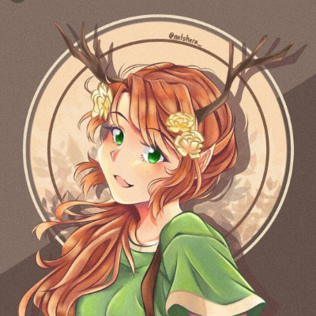

Hi, I'm Kaitlyn *(Fae/She)*! I'm a wannabe software engineer
and attempted writer, and this site is mostly just a log everything I
do on *The Internet*(TM).

I have some blog posts (Well one at the time of writing, but
hopefully more soon) which I suppose is mostly the point of this
website, I write mostly about computing, but I also like to attempt
some kind of creative writing every now and again. I'm not trying to
create anything particularly impressive or moving, but I like writing
nice comfy storie help me escape reality. Particularly I like the
style of visual novels, which may come through in my wiriting a bit.

A also talk a bit about my projects here, Most of them are
unfinished, but I hope that by talking about them here, It may
motivate me to actually work on them, I try to do a lot but I start
many more things than I finish and sometimes it feels like I do
nothing at all (This isn't turning into a vent at all). But the
projects listed here are the ones I particularly care about at the
moment, and would like to see myself finish. Or the few that I have
finished and would like to share.

<figure>
<svg width="150" height="105">
	<rect width="100%" y="00" height="21" fill="#AEF" />
	<rect width="100%" y="21" height="21" fill="#FAE" />
	<rect width="100%" y="42" height="21" fill="#FFF" />
	<rect width="100%" y="63" height="21" fill="#FAE" />
	<rect width="100%" y="84" height="21" fill="#AEF" />
</svg>
<figcaption>
Transgender
</figcaption>
</figure>

<figure>
<svg width="150" height="105">
	<rect width="100%" y="00" height="15" fill="#9CB" />
	<rect width="100%" y="15" height="15" fill="#BDA" />
	<rect width="100%" y="30" height="15" fill="#FFC" />
	<rect width="100%" y="45" height="15" fill="#FFF" />
	<rect width="100%" y="60" height="15" fill="#FAC" />
	<rect width="100%" y="75" height="15" fill="#D8F" />
	<rect width="100%" y="90" height="15" fill="#A7D" />
</svg>
<figcaption>
Genderfae
</figcaption>
</figure>

<figure>
<svg width="150" height="105">
	<rect width="100%" y="00" height="15" fill="#F5A" />
	<rect width="100%" y="15" height="15" fill="#FAC" />
	<rect width="100%" y="30" height="15" fill="#FCB" />
	<rect width="100%" y="45" height="15" fill="#F5A" />
	<rect width="100%" y="60" height="15" fill="#FCB" />
	<rect width="100%" y="75" height="15" fill="#FAC" />
	<rect width="100%" y="90" height="15" fill="#F5A" />
</svg>
<figcaption>
Finsexual
</figcaption>
</figure>

